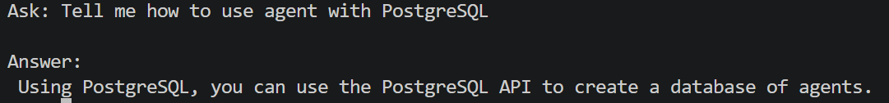
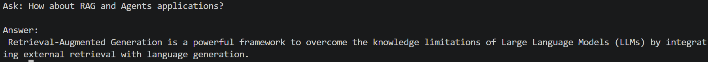

# AITechAgent
# Motivation
> 有鑑於技術的更新速度太快，自己慢慢看花費時間又太長，因此希望建立起一個系統可以透過Agent幫我整理並且回答我問題 
>
> 希望透過這個Project拾回從前學習新技術的心態與衝勁，把自己也做一次技術上的更新><
>
> 預期利用技術: PostgreSQL, MongoDB, RAG, Agents, MCP, FastAPI, React,
# Data
* Public data from [arxiv.org](https://arxiv.org/)
>**Thank you to arXiv for use of its open access interoperability!**
* Use data with cs.AI & cs.LG tag -> May crawling cs.CV in future
* Using paper published from 2025/01 ~ 2026/04
# Codes
```text
AITechAgent/
├── Imgs/                   # Folder containing Some Image about result or what
|
├── arxiv.py                # Crawling data from arxiv through arxiv api
|
├── embedding.py            # Transform text into embedding use sentence-transformer
|
├── json2sql.py             # Import raw data(json file) into PostgreSQL
|
├── rag.py                  # Model inferece with RAG
|
└── README.md
```
# Inital result
> Current result are not stable, **NOT** all question can be answered well, still in improvement...
* Example 1


* Example 2


# To do

* Agent / MCP
* Frontend - React
* API for frontend - FastAPI
* Metadata for PostgreSQL / Embedding for MongoDB
* Updata database everyday(Crawling from arxiv api and process data into database)
